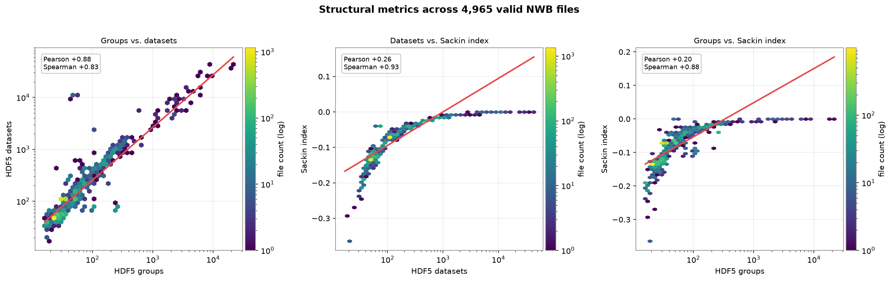
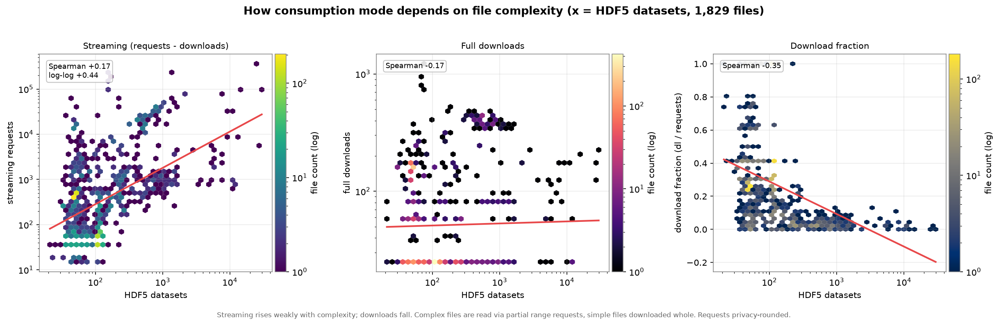

# Defining a "view" for streamed NWB assets on DANDI

*A unit of access for streaming, and why file-property normalization is the wrong correction.*

## Abstract

We propose defining a **view** of a streamed DANDI asset as a **streaming session**:
a burst of partial (range) requests from a single IP address, bounded by gaps of
more than **8 hours**. We motivate the 8-hour threshold empirically from the
distribution of inter-request intervals in the S3 access logs, and we show — by
joining structural-complexity metrics, asset size, and web-access counts across
~5,000 valid NWB files — that normalizing view counts by file size, group/dataset
count, or tree-balance (Sackin) index would not be *fair*: those quantities either
do not predict genuine interest at all, or predict only the mechanical volume of
requests that the session definition is specifically designed to absorb.

---

## 1. Background: requests are not views

DANDI serves NWB assets from S3. Two access modes dominate:

- **Full downloads** — a client retrieves the whole file (HTTP `200`).
- **Streaming** — a client opens the file remotely and issues many **partial
  range requests** (HTTP `206`), reading only the metadata tree and the specific
  datasets it needs. This is how tools such as Neurosift and `remfile`-backed
  notebooks explore a file without downloading it.

A single act of a human exploring one file produces **one download** but can
produce **hundreds to thousands of streaming requests**. Counting raw streaming
requests therefore does not measure interest — it measures a mix of interest and
the mechanical cost of reading a file remotely. To report "views," we need to
collapse each exploration episode into a single countable unit. That unit is a
**session**.

---

## 2. Defining the view: streaming sessions with an 8-hour boundary

We analyzed the inter-request intervals between consecutive streaming requests
from the same IP address across the full extraction cache (~1.37 billion streaming
requests, 46 k unique IPs, ~48 million intervals after excluding a small set of
bot/monitoring assets — see §2.1).

**Within-session activity is extremely tight.** After excluding bot traffic,
99.9 % of consecutive same-IP streaming requests fall within **2 hours**, and the
99th percentile is **18 seconds**. Exploration is bursty: many requests in quick
succession, then silence.

**The natural session boundary is ~5–9 hours.** Sweeping a candidate timeout `T`
across all timescales and measuring the fraction of gaps that fall in a ±10 %
guard band around `T` (the "ambiguity" — gaps that could plausibly be either a
within-session pause or a between-session break), the ambiguity is minimized in a
broad valley from ~4.7 h to ~8.6 h:

| candidate timeout `T` | ambiguous gaps | % of all intervals |
|---|---|---|
| 10 min | 15,546 | 0.0315 % |
| 30 min | 6,572 | 0.0133 % |
| 1 hour | 6,341 | 0.0128 % |
| 2 hours | 6,350 | 0.0129 % |
| **~8 hours (valley)** | **~800** | **0.0017 %** |
| 1 day | 13,214 | 0.0268 % |

The valley sits between two behaviors: **intra-session pauses** (essentially all
under 2 h) and **diurnal returns** (a bump rising after ~21 h). A gap of ~8 h is
the rarest thing a real user does — too long to be a pause, too short to be a
next-day visit — which makes it the most *stable* place to cut.

**Determinism.** There is no literally empty band; at this data volume gaps occur
at every lag. But at the 8-hour valley only ~1 gap in 60,000 is ambiguous, so the
definition is **near-deterministic**: the classification of essentially every
observed gap is unambiguous, and the guard-band count is a concrete metric to
monitor on future data (if it grows, the assumption is weakening). Because the
interval distribution is flat and tiny from 2 h to 8 h, **the session count is
insensitive to the exact threshold anywhere in that range** — a robustness
property that is itself the practical form of determinism.

> **Definition.** A **view** of an asset is a maximal run of streaming (`206`)
> requests from one IP to that asset in which no two consecutive requests are more
> than **8 hours** apart. Full downloads (`200`) are counted separately and are
> not views.

### 2.1 Bots

A small number of "testing" assets are polled by monitoring bots at fixed
intervals (e.g., every ~30 min or ~24 h), which injects artificial mid-range gaps
and pollutes the boundary analysis. These are identifiable — their gaps are
near-100 % *same-asset* (one IP hitting one asset on a clockwork period) and
concentrate on a handful of blobs — and are excluded up front (see
`analysis/testing_blobs.txt`). Excluding them tightened the within-session tail
(99th percentile 149 s → 18 s) and removed a spurious ~1-hour spike, revealing the
clean 5–9 h valley described above.

---

## 3. Why not normalize by a file property?

A recurring proposal is to normalize access counts by some intrinsic file
property — size, structural complexity (group/dataset counts), or the Sackin
tree-imbalance index — to "level the playing field" between assets. We joined all
of these to per-asset access counts (~4,965 files across ~265 dandisets; methods in
§5) and find that such normalization would be **unfair** for two distinct reasons.

### 3.1 Structural complexity does not predict interest

The three structural metrics are really one axis — group count, dataset count, and
Sackin index are rank-correlated 0.83–0.94, with Sackin a nonlinear restatement of
object count (Figure 1). More importantly, **none of them predicts how much an
asset is accessed**: their rank correlation with streaming volume is only
0.08–0.18.

*Figure 1. The three structural metrics are strongly monotonically related; Sackin
index saturates toward 0 as files grow. They measure complexity, not access.*

> **Note — why every Sackin index is negative.** The index is min-max normalized as
> $S_{\text{norm}} = (S - S_{\min}) / (S_{\max} - S_{\min})$, where $S$ is the sum of
> leaf depths, $S_{\max}$ is the maximally-imbalanced *caterpillar* tree, and
> $S_{\min} = n\lceil\log_2 n\rceil$ is a balanced *binary* tree. That $S_{\min}$
> reference assumes a binary tree, but NWB/HDF5 hierarchies are **high-fan-out**: a
> group holds many datasets as direct children, so leaves sit at depth ~2–3
> regardless of count. Their true leaf-depth sum therefore falls *below* the binary
> minimum, making $S - S_{\min} < 0$ and the normalized value negative. A negative
> value thus means the file is **flatter/bushier than a balanced binary tree** — as
> broad-and-shallow scientific containers should be — not that it is unusual. The
> magnitude tracks size (small files are flattest, so most negative; larger files
> accrue depth and climb toward 0), which is another way of seeing that Sackin here
> is effectively a nonlinear restatement of file size rather than an independent
> axis. A "proper" $[0, 1]$ score would require re-deriving $S_{\min}$ for
> arbitrary-degree trees — see `SUPPLEMENT_tree_metrics.md` for why the binary
> baseline is inappropriate and which alternative metrics suit NWB hierarchies.

Dividing a view count by a quantity that is uncorrelated with genuine interest does
not remove a confound — it **injects noise** and arbitrarily penalizes or rewards
assets for internal structure that has nothing to do with why people look at them.
A structurally elaborate file that nobody cares about would be boosted; a simple,
popular file would be suppressed. That is the opposite of fair.

What complexity *does* predict is **consumption mode, not volume** (Figure 2): the
fraction of accesses that are full downloads falls with complexity (Spearman
≈ −0.30). Complex files are explored via partial reads ("scrubbed"); simple files
are grabbed whole. This is exactly why the view definition is built on streaming
sessions — but it is not a basis for normalizing counts.

*Figure 2. Complexity predicts how a file is consumed (scrub vs. download whole),
not how much.*

### 3.2 Size predicts request volume — but the session definition already absorbs it

Asset **size** is a genuinely strong predictor of streaming *requests* (Spearman
**+0.74**; Figure 3) — far stronger than any structural metric, and nearly
independent of them (size and complexity are orthogonal, r ≈ −0.07).

*Figure 3. Asset size dominates streaming-request volume; structural complexity is
orthogonal to size and adds only a small residual signal.*

At first glance this argues *for* size-normalization. But consider **why** size
correlates with streaming requests: a larger file requires **more range requests
to read the same logical content** — more chunks, more metadata, more datasets to
page through. The 0.74 correlation is largely *mechanical*, not a reflection of
greater interest. This is precisely the confound that makes **raw request counts
an unfair unit** — and precisely the confound the **session definition removes**.
One person exploring one file is **one view** whether the client issued 50 range
requests or 5,000. Sessionization collapses the size-driven request inflation into
a single event, so:

- **A raw streaming-request count** *is* confounded by size and would need a size
  correction to be fair.
- **A session-based view count** has already neutralized that confound. Applying a
  further size (or complexity) normalizer would be **double-correcting** —
  penalizing large files a second time for a mechanical cost that the session unit
  has already dissolved.

In other words: the fair correction for the size confound is **to count sessions,
not to divide requests by size.** The residual, size-independent signal that
complexity adds (partial r ≈ 0.49 after controlling for size) reflects real
exploration behavior of complex files and should be *preserved as signal*, not
normalized away.

---

## 4. Recommendation

1. **Report views as streaming sessions** with an 8-hour inactivity boundary,
   per (IP, asset). Count full downloads as a separate quantity.
2. **Do not normalize view counts by size, group/dataset count, or Sackin index.**
   Complexity is uncorrelated with interest; size correlates only through a
   mechanical request-inflation effect that the session definition already
   removes. Any such normalizer would either add noise (complexity) or
   double-correct (size).
3. **Monitor the guard-band ambiguity** (fraction of same-IP gaps within ±10 % of
   8 h) over time as a health check on the definition, and keep the bot-exclusion
   list current.

---

## 5. Methods and reproducibility

- **Sessionization** — `analysis/assess_streaming_sessions.py` computes
  inter-request intervals per IP over the extraction cache, the minimum-density
  valley, the guard-band ambiguity sweep, and per-candidate bot attribution.
- **Access vs. structure** — `analysis/access_vs_structure/build_dataset.py` joins
  the `dandi-cache` structural caches (groups, datasets, Sackin index, keyed by
  content ID) → `content-id-to-nwb-file` → `dandi/access-summaries` request/download
  counts, and reads asset sizes via S3 `HEAD`. `plot_relationships.py` renders
  Figures 1–3 and prints the correlation table.

All correlations are reported as Spearman (rank/monotonic) alongside log–log
Pearson, because the distributions are heavily right-skewed and the relationships
strongly nonlinear; raw Pearson understates every monotonic effect here. Access
counts are privacy-rounded at the source (`<50` decoded to 25 and flagged).
Numbers are a snapshot and will drift as the caches and summaries update; re-run to
refresh.

**Known caveats.** (i) The size↔request correlation is measured on *requests*, not
on *sessions*; the claim that sessions neutralize the size confound is argued
mechanistically and should be confirmed by recomputing size correlation against
per-asset **session** counts once those are materialized. (ii) The
content-ID→asset mapping is 1:1, so a deduplicated blob shared by several assets is
scored by one representative asset's counts.
